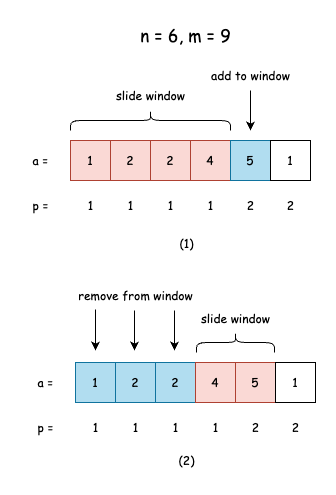

## 题目讲解
题目链接：https://codeforces.com/problemset/problem/1475/D

题目分数: 1800

题目的大致意思是：手机上有一些应用，需要移除一些来释放内存，同时每个应用有 1 跟 2 的分数值，问：在释放的内存满足条件时，算出最少被移除的分数值是多少。

参数表示如下：
- $n, (1 \le n \le 2 * 10^5)$ 表示手机应用的个数。
- $m, (1 \le m \le 10^9)$ 表示需要释放的内存大小。
- $a_1, a_2, a_3,..., a_n, (1 \le a_i \le 10^9)$ 表示每个应用占用的内存大小，数组长度为 $n$。
- $b_a, b_2, b_3,..., b_n, (1 \le b_i \le 2)$ 表示每个应用占用的分数值。
- $ans$ 表示最终结果，最少被移除的分数值。

## 解题思路

由于 $n$ 的取值范围是 $[1, 2 * 10^5]$，实现的算法复杂度应该是在 `O(n)` 或者 `O(nlogn)`。

在释放内存需要满足条件的同时，尽可能地保证被移除的分数最少，有关极值求解可能涉及到排序，那排序的策略应该如何呢？排序之后又如何计算出极值呢？

直观上来讲，应该尽可能地移除占用内存高且分数为 1 的，但也会出现一种情况，分数 2 的应用占用内存更高，虽然会移除掉这个应用会消耗 2 分，但是由于更快地满足释放内存条件，可以减少更多分数为 1 应用的移除。

综合考虑，可以把排序策略分为以下几点：
- 分数为 1 时，内存占用越小越靠前
- 分数为 2 时，内存占用越大越靠前
- 分数 1 的排在分数 2 的前面

接着，采用滑动窗口来计算极值，窗口内表示会被移除的应用。当随着窗口的位置在分数为 1 的最后面时，会尝试增加(移除)分数为 2 且内存占用较大的应用，以此来移除更多分数为 1 内存占用较小的应用，最终通过窗口的滑动来计算被移除分数的最小极值。

假设 $n = 6, m = 9$，数组 $a$ (初始化下标为 1) 为 $[5, 2, 2, 1, 4, 1]$，数组 $b$ (初始化下标为 1) 为 $[2, 1, 1, 2, 1, 1]$，经过排序策略之后如下图所示：

- 在图 (1) 中可以计算出滑动窗口内被移除内存占用为 9，满足条件，且被移除分数值 cost_point 为 $p_1+p_2+p_3+p_4=4$，当前一轮的结果 $ans = 4$
- 接着尝试把下一个值 $a_5$ 加入窗口中，并移除窗口前面的值，直到窗口内满足条件的最少应用数。
- 如图 (2)，移除 $a1$ $a2$ $a3$，此时被移除的分数值 cost_point 为 $p_4+p_5=3$，当前一轮的结果 $ans = \min(ans, 3) = 3$
- 按照滑动窗口的规律继续计算，最终得到最小值的 $ans$

## 复杂度分析

排序的时间复杂度为 $O(nlogn)$，滑动窗口的时间复杂度为 $O(n)$，整体时间复杂度为 $O(nlogn)$。

空间复杂度为 $O(1)$